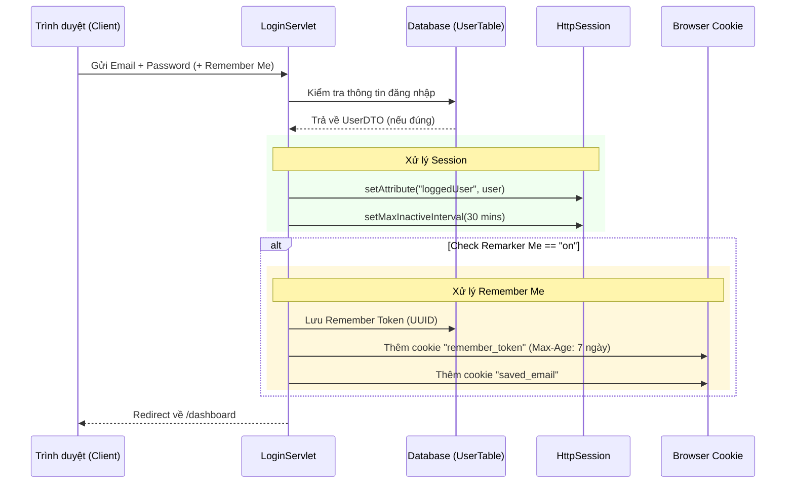
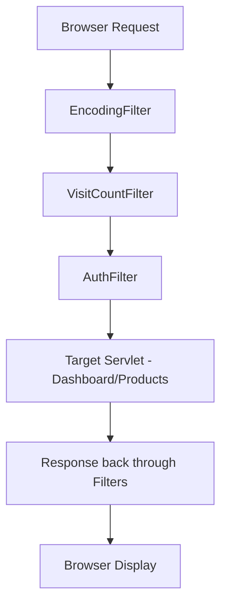

# Bài Giảng: Authentication & Filter trong Java Servlet (Dự án Uniqlo)

Chào mừng các bạn đến với bài học chuyên sâu về quản lý phiên đăng nhập và bộ lọc trong Java Servlet. Chúng ta sẽ cùng phân tích các tính năng Authentication thực tế đã được triển khai trong ứng dụng Uniqlo.

## 1. Tổng quan Kiến trúc Authentication

Hệ thống sử dụng cơ chế **Session-based Authentication** kết hợp với **Cookie (Remember Me)** để duy trì trạng thái đăng nhập của người dùng.

### Quy trình Đăng nhập (Login Flow)



---

## 2. Quản lý Phiên đăng nhập (Session Management)

### Lý thuyết
- **HttpSession**: Là một đối tượng phía Server dùng để lưu trữ dữ liệu người dùng qua nhiều request khác nhau (vì HTTP là stateless).
- **Session ID**: Server gửi một ID duy nhất (`JSESSIONID`) về trình duyệt qua Cookie. Trình duyệt sẽ gửi lại ID này trong các request sau để Server nhận diện.

### Triển khai trong Code ([LoginServlet.java](file:///d:/t3h/java2512/core/java2512/4.%20servlet-uniqlo/uniqlo-servlet/src/main/java/com/t3h/uniqlo/controller/LoginServlet.java))
```java
// Tạo session mới (hoặc lấy session hiện tại)
HttpSession session = req.getSession(true);

// Lưu đối tượng User vào session
session.setAttribute("loggedUser", user);

// Thiết lập thời gian hết hạn (30 phút không hoạt động)
session.setMaxInactiveInterval(30 * 60); 
```

---

## 3. Cơ chế Remember Me (Cookie 7 ngày)

### Khái niệm Cookie
Cookie là dữ liệu nhỏ được Server gửi về và lưu trữ tại Trình duyệt. 

### Tính năng Remember Me trong dự án
1. **Thời hạn**: 7 ngày (`7 * 24 * 60 * 60` giây).
2. **Cơ chế Token**: Thay vì lưu mật khẩu (rất nguy hiểm), hệ thống tạo một `UUID` ngẫu nhiên lưu vào Database và Cookie.
3. **Cookie `saved_email`**: Dùng để điền sẵn email vào form đăng nhập lần sau.

### Code minh họa ([LoginServlet.java](file:///d:/t3h/java2512/core/java2512/4.%20servlet-uniqlo/uniqlo-servlet/src/main/java/com/t3h/uniqlo/controller/LoginServlet.java))
```java
Cookie cookie = new Cookie("remember_token", token);
cookie.setMaxAge(7 * 24 * 60 * 60); // 7 ngày
cookie.setHttpOnly(true); // Bảo mật: JavaScript không thể đọc cookie này
resp.addCookie(cookie);
```

---

## 4. Servlet Filters - Bộ lọc yêu cầu

Filter cho phép can thiệp vào Request trước khi tới Servlet và Response trước khi về Trình duyệt.

### 4.1. Filter Chain (Chuỗi bộ lọc)

Trong dự án, yêu cầu sẽ đi qua các Filter theo thứ tự:
1. **EncodingFilter** (Xử lý Tiếng Việt)
2. **VisitCountFilter** (Đếm lượt truy cập)
3. **AuthFilter** (Kiểm tra quyền truy cập)
4. **Servlet** (Xử lý logic chính)



### 4.2. So sánh cấu hình Annotation vs XML

| Đặc điểm | Annotation (`@WebFilter`) | XML Config ([web.xml](file:///d:/t3h/java2512/core/java2512/4.%20servlet-uniqlo/uniqlo-servlet/src/main/webapp/WEB-INF/web.xml)) |
| :--- | :--- | :--- |
| **Kỹ thuật** | Sử dụng trên đầu Class Java | Khai báo trong file [web.xml](file:///d:/t3h/java2512/core/java2512/4.%20servlet-uniqlo/uniqlo-servlet/src/main/webapp/WEB-INF/web.xml) |
| **Tính linh hoạt** | Khó thay đổi thông số mà không deploy lại code | Có thể thay đổi tham số (`init-param`) dễ dàng |
| **Ví dụ trong dự án** | [EncodingFilter](file:///d:/t3h/java2512/core/java2512/4.%20servlet-uniqlo/uniqlo-servlet/src/main/java/com/t3h/uniqlo/filter/EncodingFilter.java#13-27), [AuthFilter](file:///d:/t3h/java2512/core/java2512/4.%20servlet-uniqlo/uniqlo-servlet/src/main/java/com/t3h/uniqlo/filter/AuthFilter.java#19-67) | [VisitCountFilter](file:///d:/t3h/java2512/core/java2512/4.%20servlet-uniqlo/uniqlo-servlet/src/main/java/com/t3h/uniqlo/filter/VisitCountFilter.java#13-67) |

---

## 5. Chi tiết các Filter trong hệ thống

### A. EncodingFilter (Annotation config)
Đảm bảo mọi dữ liệu gửi lên và trả về đều hỗ trợ UTF-8 (Tiếng Việt).
- **Annotation**: `@WebFilter(urlPatterns = "/*")`
- **Chức năng**: `request.setCharacterEncoding("UTF-8");`

### B. AuthFilter (Authorization & Auto-login)
Bảo vệ các trang `/dashboard` và `/productions`.
- **Logic**:
    - Nếu có Session `loggedUser` -> Cho qua.
    - Nếu không có Session nhưng có Cookie `remember_token` -> Tìm User trong DB và tự động tạo Session lại (Auto-login).
    - Nếu không có cả hai -> Chuyển hướng về `/login`.

### C. VisitCountFilter (XML config + FilterConfig)
Minh họa cách cấu hình Filter qua XML và dùng `ServletContext` để chia sẻ dữ liệu toàn ứng dụng.
- **Cấu hình web.xml**:
```xml
<filter>
    <filter-name>visitCountFilter</filter-name>
    <filter-class>com.t3h.uniqlo.filter.VisitCountFilter</filter-class>
    <init-param>
        <param-name>excludePrefix</param-name>
        <param-value>/assets</param-value>
    </init-param>
</filter>
```
- **FilterConfig**: Dùng để đọc `excludePrefix` từ XML.
- **ServletContext**: Dùng để lưu tổng số `visitCount` để hiển thị trên Dashboard.

---

## 6. Hiển thị thông tin tại Dashboard ([dashboard.jsp](file:///d:/t3h/java2512/core/java2512/4.%20servlet-uniqlo/uniqlo-servlet/src/main/webapp/WEB-INF/views/auth/dashboard.jsp))

Trang Dashboard minh họa cách lấy dữ liệu từ Session và Cookie để hiển thị cho người dùng:
- **Session ID**: `session.getId()`
- **Thời gian tạo**: `session.getCreationTime()`
- **Thông tin User**: Lấy từ attribute `loggedUser`.
- **Lượt truy cập**: Lấy từ `getServletContext().getAttribute("visitCount")`.

---

## Tổng kết kiến thức
1. **Session** dùng để lưu trạng thái tạm thời trên Server.
2. **Cookie** dùng để lưu dữ liệu lâu dài trên Trình duyệt.
3. **Filter** là công cụ mạnh mẽ để xử lý các tác vụ xuyên suốt (Cross-cutting concerns) như bảo mật, mã hóa, log.
4. **Annotation** giúp code gọn gàng, **XML** giúp cấu hình linh hoạt.
