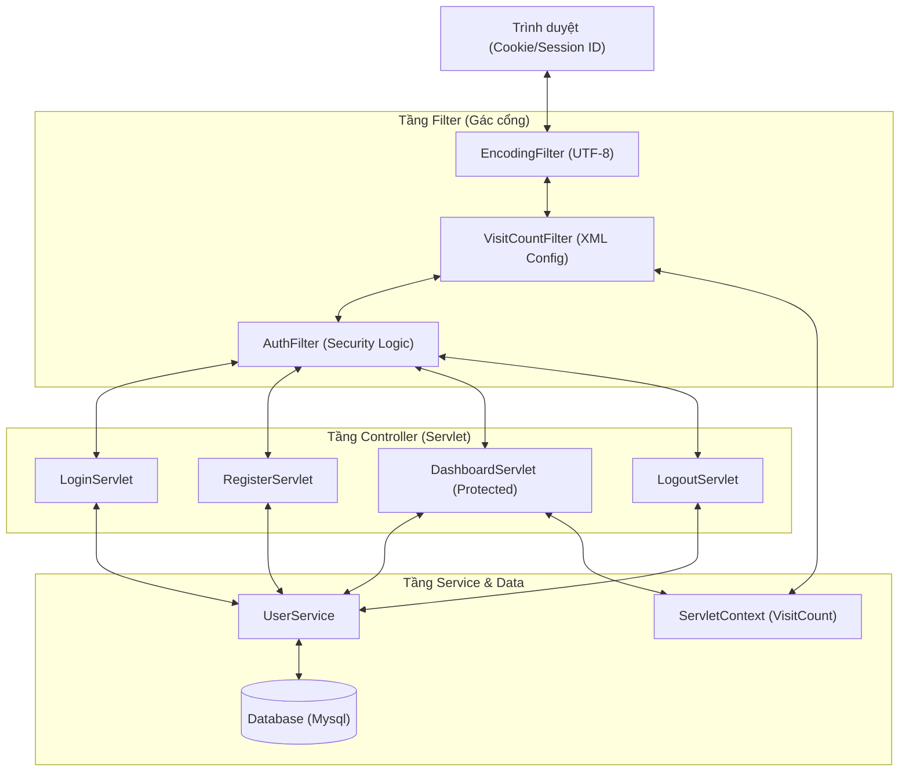
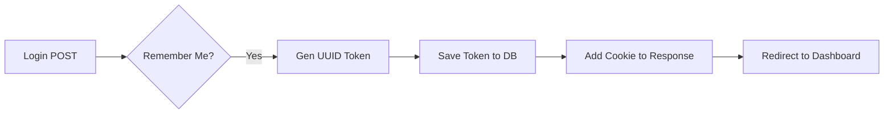
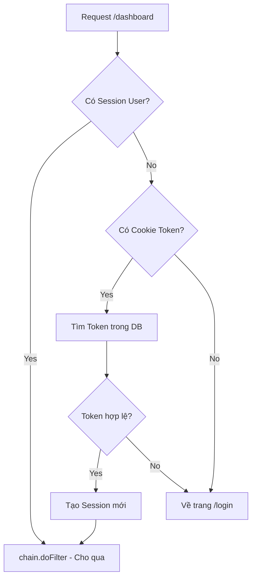

# Giáo Trình Chuyên Sâu: Authentication & Filter (Dự án Uniqlo)

Tài liệu này cung cấp cái nhìn chi tiết nhất về cơ chế bảo mật, quản lý phiên và bộ lọc trong lập trình Java Web (Servlet/JSP). Chúng ta sẽ đi sâu vào từng dòng code và các khái niệm hạ tầng đứng sau chúng.

---

## 0. Sơ đồ Tổng quan Hệ thống (System Overview)

Dưới đây là sơ đồ kiến trúc tổng quát của luồng dữ liệu khi người dùng tương tác với các tính năng Auth.



---

## 1. Cơ chế Quản lý Phiên (Session Management)

### 1.1. Khái niệm HttpSession
HTTP là giao thức "không trạng thái" (Stateless). Để Server "nhớ" được một người dùng đã đăng nhập hay chưa, Java Servlet cung cấp đối tượng `HttpSession`.

- **Cơ chế hoạt động**: Khi `getSession(true)` được gọi, Server tạo một ID duy nhất (`JSESSIONID`). ID này được lưu vào Cookie tại trình duyệt. Mọi request tiếp theo của trình duyệt sẽ kèm theo ID này để Server đối chiếu.

### 1.2. Giải thích code trong [LoginServlet.java](file:///d:/t3h/java2512/core/java2512/4.%20servlet-uniqlo/uniqlo-servlet/src/main/java/com/t3h/uniqlo/controller/LoginServlet.java)

```java
// doPost method
HttpSession session = req.getSession(true); // Tạo session mới nếu chưa có
session.setAttribute("loggedUser", user);   // Lưu đối tượng UserDTO vào vùng nhớ Server
session.setMaxInactiveInterval(30 * 60);    // Sau 30 phút không hoạt động, session tự hủy
```

- **`req.getSession(true)`**: Tham số `true` cực kỳ quan trọng. Nó đảm bảo một vùng nhớ riêng tư được khởi tạo cho Client này.
- **`setAttribute`**: Dữ liệu lưu ở đây không bao giờ gửi về Client (khác với Cookie), đảm bảo tính bảo mật cho thông tin nhạy cảm.

---

## 2. Cơ chế Remember Me (Cookie 7 ngày)

### 2.1. Tại sao không lưu mật khẩu vào Cookie?
Việc lưu mật khẩu vào Cookie là một lỗ hổng bảo mật nghiêm trọng. Dự án Uniqlo sử dụng cơ chế **Token-based**.

### 2.2. Luồng xử lý chi tiết



### 2.3. Giải thích code chi tiết ([LoginServlet.java](file:///d:/t3h/java2512/core/java2512/4.%20servlet-uniqlo/uniqlo-servlet/src/main/java/com/t3h/uniqlo/controller/LoginServlet.java))

```java
if ("on".equals(rememberMe)) {
    String token = UUID.randomUUID().toString(); // Tạo chuỗi định danh ngẫu nhiên
    userService.saveRememberToken(user.getId(), token); // Lưu vào DB để đối soát sau này

    Cookie cookie = new Cookie("remember_token", token);
    cookie.setMaxAge(7 * 24 * 60 * 60); // 604,800 giây = 7 ngày
    cookie.setPath("/");                // Cookie có hiệu lực trên toàn bộ website
    cookie.setHttpOnly(true);           // Ngăn chặn các cuộc tấn công XSS (JS không đọc được)
    resp.addCookie(cookie);
}
```

- **`setHttpOnly(true)`**: Đây là kỹ thuật bảo mật bắt buộc. Nếu hacker chèn được script vào trang (XSS), chúng cũng không thể đánh cắp token này.

---

## 3. Hệ thống Bộ lọc (Servlet Filters)

Filter là "người gác cổng". Một request có thể đi qua nhiều cổng (Filter Chain) trước khi gặp Servlet.

### 3.1. EncodingFilter - Bảo đảm Tiếng Việt
Đây thường là Filter đầu tiên trong chuỗi để xử lý dữ liệu đầu vào.

```java
@WebFilter(filterName = "EncodingFilter", urlPatterns = "/*")
public class EncodingFilter implements Filter {
    public void doFilter(ServletRequest request, ServletResponse response, FilterChain chain) {
        request.setCharacterEncoding("UTF-8");  // Cho phép nhận Tiếng Việt từ Form
        response.setCharacterEncoding("UTF-8"); // Trả về Tiếng Việt cho Browser
        chain.doFilter(request, response);      // "Mở cửa" cho request đi tới Filter tiếp theo
    }
}
```

### 3.2. VisitCountFilter - Cấu hình XML & ServletContext
Filter này minh họa cách sử dụng [web.xml](file:///d:/t3h/java2512/core/java2512/4.%20servlet-uniqlo/uniqlo-servlet/src/main/webapp/WEB-INF/web.xml) để cấu hình tham số mà không cần sửa code Java.

- **Khái niệm `FilterConfig`**: Dùng để đọc `init-param` được khai báo trong XML.
- **Khái niệm `ServletContext`**: Là vùng nhớ dùng chung cho TOÀN BỘ ứng dụng (Global).

```java
// Trong web.xml
<init-param>
    <param-name>excludePrefix</param-name>
    <param-value>/assets</param-value>
</init-param>
```

```java
// Trong VisitCountFilter.java
public void init(FilterConfig filterConfig) {
    this.excludePrefix = filterConfig.getInitParameter("excludePrefix");
    // Lưu visitCount vào ServletContext để mọi Servlet/JSP đều có thể lấy ra
    filterConfig.getServletContext().setAttribute("visitCount", currentCount);
}
```

### 3.3. AuthFilter - Trái tim bảo mật
Filter này bảo vệ các tài nguyên nhạy cảm. Nó hoạt động như một máy kiểm tra tự động.



**Giải thích code [AuthFilter.java](file:///d:/t3h/java2512/core/java2512/4.%20servlet-uniqlo/uniqlo-servlet/src/main/java/com/t3h/uniqlo/filter/AuthFilter.java)**:
- `req.getSession(false)`: Lấy session nếu có, nếu không thì trả về `null` (không tự động tạo mới). Đây là cách check login chuẩn.
- `resp.sendRedirect(loginUrl + "?redirect=" + req.getServletPath())`: Lưu lại trang người dùng đang định vào để sau khi login xong có thể quay lại đúng trang đó.

---

## 4. Tương tác tại Tầng Hiển thị (JSP)

Trang [dashboard.jsp](file:///d:/t3h/java2512/core/java2512/4.%20servlet-uniqlo/uniqlo-servlet/src/main/webapp/WEB-INF/views/auth/dashboard.jsp) thực tế là một nơi để "debug" và hiển thị kết quả của các quá trình trên:

- **Lấy thông tin Session**:
  - `${sessionId}`: Hiển thị chuỗi JSESSIONID.
  - `${sessionTimeout}`: Hiển thị thời gian sống còn lại của phiên.
- **Lấy thông tin Cookie**:
  - Sử dụng JSTL `${cookie.remember_token.value}` để kiểm tra token có tồn tại ở Client không.
- **Lấy dữ liệu Global**:
  - `${visitCount}`: Tổng lượt truy cập được [VisitCountFilter](file:///d:/t3h/java2512/core/java2512/4.%20servlet-uniqlo/uniqlo-servlet/src/main/java/com/t3h/uniqlo/filter/VisitCountFilter.java#13-67) cập nhật liên tục.

---

## 5. Tổng kết Các Khái niệm Quan trọng

| Khái niệm | Phạm vi (Scope) | Mục đích chính |
| :--- | :--- | :--- |
| **Request Attribute** | 1 Request | Truyền dữ liệu từ Servlet sang JSP (xử lý xong là mất). |
| **Session Attribute** | 1 Người dùng (Phiên) | Giữ trạng thái đăng nhập, giỏ hàng... |
| **ServletContext** | Toàn ứng dụng | Lưu config chung, đếm lượt truy cập, cache dữ liệu... |
| **Cookie** | Phía Trình duyệt | Ghi nhớ phiên đăng nhập (Persistent) qua nhiều lần mở máy. |
| **FilterConfig** | 1 Filter | Đọc tham số cấu hình từ file XML. |

**Lời khuyên**: Luôn ưu tiên dùng **Filter** cho logic kiểm tra quyền để tránh viết lặp code (Don't Repeat Yourself - DRY) trong từng Servlet.

---

## 6. Kịch bản Demo Toàn bộ Tính năng

Dưới đây là kịch bản 5 bước để bạn có thể demo và kiểm chứng toàn bộ các tính năng đã học trong code:

### Bước 1: Kiểm chứng Encoding & VisitCount (XML Config)
- **Hành động**: Mở trình duyệt, truy cập bất kỳ trang nào (ví dụ `/login`).
- **Kiểm chứng**:
    - Nhập Tiếng Việt có dấu vào form (ví dụ: "Nguyễn Văn A"). Nếu dữ liệu lưu vào DB hoặc hiển thị lại vẫn đúng dấu -> [EncodingFilter](file:///d:/t3h/java2512/core/java2512/4.%20servlet-uniqlo/uniqlo-servlet/src/main/java/com/t3h/uniqlo/filter/EncodingFilter.java#13-27) hoạt động.
    - F5 trang vài lần. Vào Dashboard (sau khi login) xem số `visitCount`. Nếu số tăng lên -> [VisitCountFilter](file:///d:/t3h/java2512/core/java2512/4.%20servlet-uniqlo/uniqlo-servlet/src/main/java/com/t3h/uniqlo/filter/VisitCountFilter.java#13-67) hoạt động.

### Bước 2: Đăng nhập & Tạo Session
- **Hành động**: Nhập Email/Password, **KHÔNG** tích chọn "Remember Me", rồi nhấn Login.
- **Kiểm chứng**:
    - Sau khi vào Dashboard, kiểm tra `sessionId` hiển thị trên màn hình.
    - Mở DevTools (F12) -> Application -> Cookies. Tìm `JSESSIONID`. Giá trị này phải khớp với `sessionId` trên UI.

### Bước 3: Kiểm chứng Session Timeout
- **Hành động**: Tại Dashboard, chờ 30 phút (hoặc tạm sửa code `setMaxInactiveInterval(10)` để test nhanh). F5 lại trang.
- **Kiểm chứng**: Hệ thống phải tự đẩy bạn ra trang `/login` vì Session đã hết hạn.

### Bước 4: Kiểm chứng Remember Me (7 ngày)
- **Hành động**: Đăng nhập lại, lần này **TÍCH CHỌN** "Remember Me".
- **Kiểm chứng**:
    - Kiểm tra DevTools -> Cookies. Xuất hiện thêm cookie `remember_token` và `saved_email`.
    - Tắt trình duyệt hoàn toàn, rồi mở lại và truy cập thẳng vào `/dashboard`.
    - **Kết quả mong đợi**: Bạn vẫn vào được Dashboard mà không cần login lại (Do [AuthFilter](file:///d:/t3h/java2512/core/java2512/4.%20servlet-uniqlo/uniqlo-servlet/src/main/java/com/t3h/uniqlo/filter/AuthFilter.java#19-67) đã tự động login bằng token).

### Bước 5: Đăng xuất & Dọn dẹp
- **Hành động**: Nhấn nút "Logout" trên Dashboard.
- **Kiểm chứng**:
    - Trình duyệt chuyển về `/login`.
    - Kiểm tra Cookies trong DevTools: `remember_token` và `JSESSIONID` cũ phải biến mất hoặc hết hạn.
    - Thử nhấn nút Back trên trình duyệt: Bạn không được phép quay lại Dashboard (Vì Session đã bị `invalidate()`).
