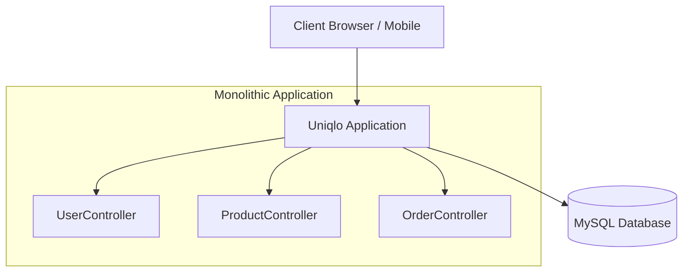
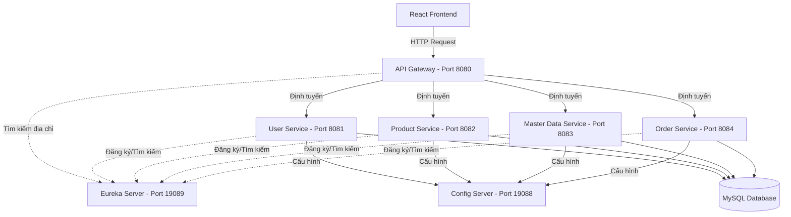

# BÀI GIẢNG: KIẾN TRÚC MICROSERVICE
## Chuyển Đổi Từ Monolithic Sang Microservice Với Spring Cloud Và React

**Đối tượng:** Lập trình viên Java đã có nền tảng Spring Boot.
**Thời lượng:** 8-10 tiết.
**Dự án thực hành:** Hệ thống thương mại điện tử Uniqlo.

---

## MỤC LỤC

1. [Monolithic vs Microservice – Khái Niệm Cơ Bản](#1-monolithic-vs-microservice)
2. [Thiết Kế Kiến Trúc Microservice Cho Hệ Thống Uniqlo](#2-thiết-kế-kiến-trúc-microservice-cho-hệ-thống-uniqlo)
3. [Spring Cloud Config – Quản Lý Cấu Hình Tập Trung](#3-spring-cloud-config--quản-lý-cấu-hình-tập-trung)
4. [Eureka Server – Trung Tâm Đăng Ký Service](#4-eureka-server--trung-tâm-đăng-ký-service)
5. [API Gateway – Cửa Ngõ Giao Tiếp Duy Nhất](#5-api-gateway--cửa-ngõ-giao-tiếp-duy-nhất)
6. [Giao Tiếp Giữa Các Service Backend](#6-giao-tiếp-giữa-các-service-backend)
7. [Mô Hình Dữ Liệu Và Các Backend Microservice](#7-mô-hình-dữ-liệu-và-các-backend-microservice)
8. [Tích Hợp Frontend ReactJS](#8-tích-hợp-frontend-reactjs)

---

## 1. MONOLITHIC VS MICROSERVICE

### 1.1 Vấn Đề Của Kiến Trúc Monolithic

Trong giai đoạn đầu, dự án Uniqlo được xây dựng theo kiến trúc Monolithic (nguyên khối). Tất cả các module như Quản lý người dùng, Sản phẩm, Giỏ hàng, Đơn hàng đều được gói gọn trong một file `.jar` hoặc `.war` duy nhất và kết nối chung vào một cơ sở dữ liệu.



Khi hệ thống phát triển, kiến trúc Monolithic bộc lộ nhiều nhược điểm chí mạng:
- **Rủi ro triển khai cao:** Một thay đổi nhỏ ở tính năng đánh giá sản phẩm cũng yêu cầu phải khởi động lại toàn bộ hệ thống.
- **Không thể mở rộng cục bộ:** Trong dịp Black Friday, lượng truy cập xem sản phẩm tăng vọt nhưng tính năng thanh toán lại ít dùng. Tuy nhiên, hệ thống bắt buộc phải nhân bản toàn bộ cả khối ứng dụng thay vì chỉ nhân bản module quản lý sản phẩm, gây lãng phí tài nguyên máy chủ.
- **Lỗi dây chuyền (Single Point of Failure):** Một vòng lặp vô hạn ở module giỏ hàng có thể tiêu thụ toàn bộ CPU, khiến cả hệ thống tê liệt.

### 1.2 Giải Pháp Microservice

Kiến trúc Microservice chia nhỏ hệ thống thành các ứng dụng độc lập, giao tiếp với nhau qua mạng (thường là HTTP/REST). Mỗi service đảm nhận một nghiệp vụ (domain) riêng biệt.

- **Triển khai độc lập:** Có thể cập nhật Product Service mà không làm gián đoạn User Service.
- **Mở rộng linh hoạt:** Khi cần thiết, có thể chạy 5 instances của Product Service và chỉ 1 instance của Master Data Service.
- **Cô lập lỗi:** Lỗi ở module Đơn hàng không làm sập module Người dùng.

---

## 2. THIẾT KẾ KIẾN TRÚC MICROSERVICE CHO HỆ THỐNG UNIQLO

Hệ thống Uniqlo được chia thành các thành phần chính sau:



*Lưu ý: Để đơn giản hóa môi trường học tập, hệ thống vẫn dùng chung một Database. Trong thực tế (Production), mỗi microservice nên sở hữu một Database độc lập để đảm bảo tính cô lập dữ liệu tuyệt đối.*

---

## 3. SPRING CLOUD CONFIG – QUẢN LÝ CẤU HÌNH TẬP TRUNG

Khi có 5-10 microservice, việc thay đổi mật khẩu database trong 10 file `application.yml` rất dễ sai sót. Spring Cloud Config Server giải quyết vấn đề này bằng cách kéo cấu hình từ một kho lưu trữ Git và cung cấp tập trung cho các service.

### 3.1 Cấu hình Config Server

**Thêm Dependency (pom.xml):**
```xml
<dependency>
    <groupId>org.springframework.cloud</groupId>
    <artifactId>spring-cloud-config-server</artifactId>
</dependency>
```

**Kích hoạt Server:**
```java
@SpringBootApplication
@EnableConfigServer
public class ConfigServerApplication {
    public static void main(String[] args) {
        SpringApplication.run(ConfigServerApplication.class, args);
    }
}
```

**application.yml (Config Server):**
```yaml
server:
  port: 19088

spring:
  application:
    name: config-server
  cloud:
    config:
      server:
        git:
          uri: file:///D:/t3h/java2512/core/java2512/8. microservice/config-repo
```

### 3.2 Cấu hình Client (Microservice)

Thay vì viết cấu hình dài dòng, các backend service chỉ cần khai báo địa chỉ của Config Server.

**application.yml (User Service):**
```yaml
spring:
  application:
    name: user-service
  config:
    import: "optional:configserver:http://localhost:19088"
```

---

## 4. EUREKA SERVER – TRUNG TÂM ĐĂNG KÝ SERVICE

Service Discovery là thành phần cốt lõi của microservice. Do các service có thể khởi động ở các port ngẫu nhiên hoặc ở nhiều máy chủ khác nhau, chúng không thể gọi nhau bằng IP tĩnh. Eureka Server đóng vai trò như một "cuốn bạ điện thoại".

### 4.1 Cấu hình Eureka Server

**pom.xml:**
```xml
<dependency>
    <groupId>org.springframework.cloud</groupId>
    <artifactId>spring-cloud-starter-netflix-eureka-server</artifactId>
</dependency>
```

**Kích hoạt Server:**
```java
@SpringBootApplication
@EnableEurekaServer
public class EurekaServerApplication {
    public static void main(String[] args) {
        SpringApplication.run(EurekaServerApplication.class, args);
    }
}
```

**application.yml:**
```yaml
server:
  port: 19089

eureka:
  client:
    register-with-eureka: false
    fetch-registry: false
```

### 4.2 Eureka Client (Đăng ký service)

Bất kỳ service nào muốn tham gia mạng lưới đều phải khai báo dependency `spring-cloud-starter-netflix-eureka-client` và cấu hình địa chỉ Eureka Server.

**application.yml (Cho mọi Backend Service & Gateway):**
```yaml
eureka:
  client:
    service-url:
      defaultZone: http://localhost:19089/eureka/
  instance:
    prefer-ip-address: true
```

---

## 5. API GATEWAY – CỬA NGÕ GIAO TIẾP DUY NHẤT

Nếu không có Gateway, Frontend React sẽ phải nhớ port 8081 để gọi API User, nhớ port 8082 để gọi API Product. Điều này dẫn đến sự ràng buộc cứng (tight coupling) và gặp vấn đề về bảo mật (CORS).

Spring Cloud Gateway tạo ra một điểm nghẽn duy nhất để kiểm soát lưu lượng, xác thực token và định tuyến.

### 5.1 Cấu hình Gateway

**pom.xml:**
```xml
<dependency>
    <groupId>org.springframework.cloud</groupId>
    <artifactId>spring-cloud-starter-gateway</artifactId>
</dependency>
<dependency>
    <groupId>org.springframework.cloud</groupId>
    <artifactId>spring-cloud-starter-netflix-eureka-client</artifactId>
</dependency>
```

**application.yml (Phân luồng định tuyến):**
```yaml
server:
  port: 8080

spring:
  cloud:
    gateway:
      routes:
        - id: user-service
          uri: lb://USER-SERVICE
          predicates:
            - Path=/api/users/**,/api/v1/auth/**
            
        - id: product-service
          uri: lb://PRODUCT-SERVICE
          predicates:
            - Path=/api/products/**
```
Lưu ý cú pháp `lb://USER-SERVICE`: Gateway sẽ kết hợp với Eureka và Load Balancer để chuyển URL `/api/users/1` thành HTTP Request thật tới `http://192.168.1.10:8081/api/users/1`.

---

## 6. GIAO TIẾP GIỮA CÁC SERVICE BACKEND

Khi Microservice bị chia nhỏ, dữ liệu cũng bị chia nhỏ. Ví dụ: Order Service giữ thông tin đơn hàng, nhưng lại cần thông tin chi tiết của người dùng. Để làm được điều này, Order Service phải thực hiện HTTP Call nội bộ sang User Service.

Công cụ phổ biến nhất trong Spring Boot là `RestTemplate` kết hợp `@LoadBalanced`.

### 6.1 Khởi tạo RestTemplate

```java
@Configuration
public class RestTemplateConfig {

    @Bean
    @LoadBalanced
    public RestTemplate restTemplate() {
        return new RestTemplate();
    }
}
```
Annotation `@LoadBalanced` vô cùng quan trọng. Nó chỉ thị cho Spring can thiệp vào RestTemplate, phân tích các URL có chứa tên service (như `USER-SERVICE`) và nhờ Eureka phân giải thành địa chỉ IP thực tế trước khi gửi yêu cầu.

### 6.2 Code Demo Giao Tiếp

**Ví dụ trong Product Service muốn lấy dữ liệu từ Master Data Service:**

```java
@Service
@RequiredArgsConstructor
public class ProductService {
    
    private final RestTemplate restTemplate;
    
    public List<CategoryDto> getAllCategoriesForProduct() {
        // Địa chỉ URL dùng TÊN ỨNG DỤNG viết hoa, không dùng IP cục bộ.
        String masterDataUrl = "http://MASTER-DATA-SERVICE/api/categories";
        
        CategoryDto[] response = restTemplate.getForObject(masterDataUrl, CategoryDto[].class);
        
        return Arrays.asList(response);
    }
}
```

---

## 7. MÔ HÌNH DỮ LIệu VÀ CÁC BACKEND MICROSERVICE

Cơ sở dữ liệu được phân tích và chia thành 4 nghiệp vụ chính:

### 7.1 User Service (Quản Lý Người Dùng)
- **Chức năng:** Đăng nhập, đăng ký, cấp phát JWT, xác thực, phân quyền, quản lý tài khoản.
- **Entity:** `User`, `Role`, `Token`.

### 7.2 Product Service (Quản Lý Sản Phẩm)
- **Chức năng:** Hiển thị sản phẩm, lọc theo giá, xem chi tiết, biến thể (SKU), kho lưu trữ hình ảnh.
- **Entity:** `Product`, `ProductSku`, `ProductImage`.

### 7.3 Master Data Service (Dữ Liệu Danh Mục)
- **Chức năng:** Cung cấp thông tin ít biến động nhưng dùng chung cho nhiều chỗ.
- **Entity:** `Category`, `Color`, `Size`.

### 7.4 Order Service (Giỏ Hàng & Đơn Hàng)
- **Chức năng:** Thêm vào giỏ, thanh toán, quản lý đơn hàng, đánh giá sản phẩm, thống kê lượt truy cập.
- **Entity:** `CartItem`, `Review`, `VisitStat`, (Order).

---

## 8. TÍCH HỢP FRONTEND REACTJS

Bên phía Frontend, quá trình tích hợp trở nên cực kỳ đơn giản. Lập trình viên Frontend không cần quan tâm đằng sau có bao nhiêu microservice. Họ chỉ cần coi API Gateway như một backend duy nhất.

### 8.1 Cấu hình Axios với Gateway

```javascript
import axios from 'axios';

const api = axios.create({
  baseURL: 'http://localhost:8080',  // Chỉ gọi duy nhất vào cổng Gateway
  timeout: 10000,
});

// Interceptor tự động thêm JWT vào mọi Request
api.interceptors.request.use((config) => {
  const token = localStorage.getItem('access_token');
  if (token) {
    config.headers.Authorization = `Bearer ${token}`;
  }
  return config;
});

export default api;
```

### 8.2 Gọi API Sản Phẩm

```javascript
import api from './axiosConfig';

export const fetchProducts = async () => {
    // Frontend gọi /api/products -> Gateway nhận -> Forward sang Product Service
    const response = await api.get('/api/products');
    return response.data;
};
```

Kiến trúc Microservice đem lại sự rạch ròi giữa các khâu phát triển, đặc biệt hiệu quả trong các hệ thống quy mô lớn, nhiều nghiệp vụ phức tạp. Việc triển khai thành công mô hình này đòi hỏi sự thiết lập nghiêm ngặt ngay từ đầu đối với Config Server, Service Registry, và API Gateway.
