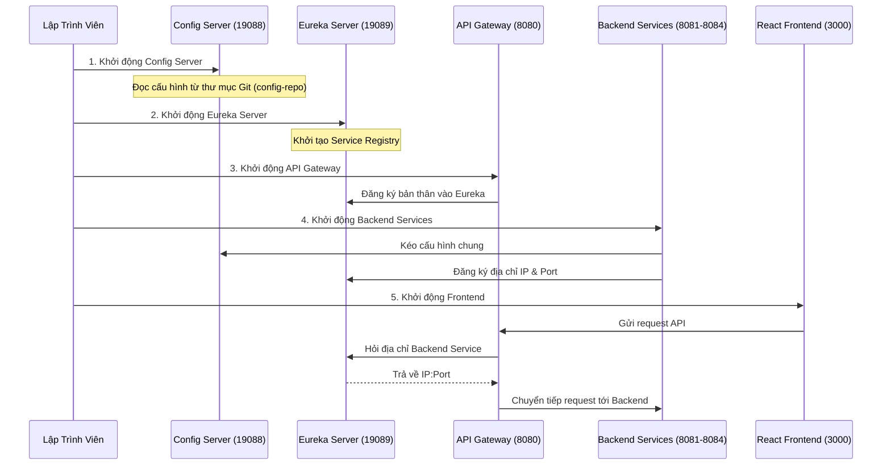

# Hướng Dẫn Chạy Toàn Bộ Hệ Thống Uniqlo Microservice

Tài liệu này cung cấp hướng dẫn chi tiết từng bước để khởi động hệ thống Uniqlo Microservice, kèm theo giải thích kiến trúc và luồng hoạt động.

## 1. Yêu Cầu Môi Trường
- Java 17 hoặc mới hơn
- Maven 3.8 hoặc mới hơn
- Node.js 18 hoặc mới hơn
- MySQL 8 (Cần tạo database `uniqlo_education` và import dữ liệu ban đầu nếu cần)

## 2. Kiến Trúc Khởi Động Hệ Thống

Hệ thống Microservice yêu cầu thứ tự khởi động nghiêm ngặt để đảm bảo các service phụ thuộc có thể tìm thấy nhau.



## 3. Quy Hoạch Cổng (Port Mapping)
Để đảm bảo các service không xung đột trên máy tính cá nhân, hệ thống được cấu hình theo danh sách cổng sau:

- **19088**: Config Server (Cung cấp cấu hình tập trung)
- **19089**: Eureka Server (Trung tâm đăng ký dịch vụ)
- **8080**: API Gateway (Cổng giao tiếp duy nhất cho Frontend)
- **8081**: User Service (Quản lý người dùng, phân quyền)
- **8082**: Product Service (Quản lý sản phẩm)
- **8083**: Master Data Service (Quản lý danh mục, màu sắc, kích cỡ)
- **8084**: Order Service (Quản lý giỏ hàng, đơn hàng)
- **3000**: Frontend React (Giao diện người dùng)

## 4. Hướng Dẫn Khởi Động Từng Bước

Lưu ý: Bạn có thể sử dụng file `start_all.bat` ở thư mục gốc để tự động hóa toàn bộ quá trình khởi động dưới đây. Nếu muốn chạy thủ công để kiểm tra lỗi, hãy làm theo các bước:

### Bước 1: Khởi động Config Server
Config Server cần được khởi động đầu tiên để cung cấp cấu hình cho các service khác.
```bash
cd source_microservice/config-server
mvn spring-boot:run
```
Kiểm tra: Truy cập `http://localhost:19088/actuator/health`

### Bước 2: Khởi động Eureka Server
Eureka Server là trái tim của hệ thống định tuyến nội bộ.
```bash
cd source_microservice/eureka-server
mvn spring-boot:run
```
Kiểm tra: Truy cập `http://localhost:19089` để xem bảng điều khiển Eureka. Lúc này danh sách service sẽ trống.

### Bước 3: Khởi động API Gateway
Gateway đóng vai trò tiếp nhận mọi yêu cầu từ Frontend.
```bash
cd source_microservice/eureka-gateway
mvn spring-boot:run
```
Kiểm tra: Sau khi chạy thành công, refresh lại bảng điều khiển Eureka (`http://localhost:19089`), bạn sẽ thấy `EUREKA-GATEWAY` xuất hiện.

### Bước 4: Khởi động các Backend Service
Bạn có thể mở nhiều cửa sổ terminal để chạy song song 4 service này.

User Service:
```bash
cd source_microservice/user-service
mvn spring-boot:run
```

Product Service:
```bash
cd source_microservice/product-service
mvn spring-boot:run
```

Master Data Service:
```bash
cd source_microservice/master-data-service
mvn spring-boot:run
```

Order Service:
```bash
cd source_microservice/order-service
mvn spring-boot:run
```
Kiểm tra: Truy cập lại Eureka Dashboard (`http://localhost:19089`). Bạn phải thấy đầy đủ các ứng dụng: `USER-SERVICE`, `PRODUCT-SERVICE`, `MASTER-DATA-SERVICE`, `ORDER-SERVICE` hiển thị trạng thái `UP`.

### Bước 5: Khởi động React Frontend
```bash
cd source_microservice/frontend
npm install
npm start
```
Giao diện sẽ tự động mở tại `http://localhost:3000`.

## 5. Xử Lý Sự Cố Thường Gặp

### Lỗi Cổng Đã Bị Chiếm Dụng (Port in use)
Nếu một service báo lỗi cổng đã được sử dụng, bạn có thể dùng PowerShell để tìm và tắt tiến trình đang chiếm cổng (ví dụ cổng 8080):
```powershell
$pid = (Get-NetTCPConnection -LocalPort 8080 -State Listen -ErrorAction SilentlyContinue | Select-Object -ExpandProperty OwningProcess -Unique)
if ($pid) { Stop-Process -Id $pid -Force }
```

### Lỗi Cannot Execute Request on Any Known Server
Nguyên nhân: Backend service không tìm thấy Eureka Server.
Giải pháp: Đảm bảo Eureka Server đang chạy đúng ở cổng 19089. Kiểm tra file `application.yml` của service báo lỗi xem `eureka.client.service-url.defaultZone` đã cấu hình đúng thành `http://localhost:19089/eureka/` hay chưa.

### Lỗi OutOfMemory (OOM)
Hệ thống chạy 7 ứng dụng Java cùng lúc sẽ tốn rất nhiều RAM. Hãy cấu hình tham số JVM khi chạy để giới hạn RAM. Nếu dùng command line, bạn có thể cấu hình thông qua biến môi trường:
```bash
set MAVEN_OPTS=-Xms64m -Xmx256m
mvn spring-boot:run
```
(File `start_all.bat` đã tích hợp sẵn tính năng này).
