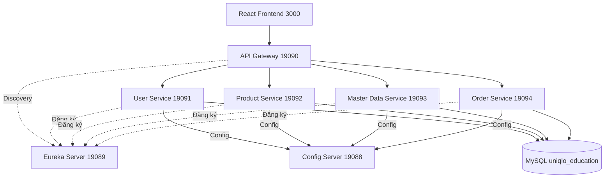

# Hướng dẫn chạy toàn bộ hệ thống Uniqlo Microservice

## 1. Chuẩn bị môi trường
- Java 17+
- Maven 3.8+
- Node.js 18+
- MySQL 8 (tạo database uniqlo_education, import dữ liệu nếu cần)

## 1.1 Quy hoạch port mới (tránh xung đột)
- Config Server: 19088
- Eureka Server: 19089
- API Gateway: 19090
- User Service: 19091
- Product Service: 19092
- Master Data Service: 19093
- Order Service: 19094
- Frontend React: 3000

## 2. Thứ tự khởi động các service

### Bước 1: Khởi động Config Server
```bash
cd 8. microservice/source_microservice/config-server
mvn spring-boot:run
```
- Truy cập http://localhost:19088/actuator/health để kiểm tra.

### Bước 2: Khởi động Eureka Server
```bash
cd 8. microservice/source_microservice/eureka-server
mvn spring-boot:run
```
- Truy cập http://localhost:19089 để kiểm tra dashboard Eureka.

### Bước 3: Khởi động Eureka Gateway
Nếu gặp lỗi port 19090 đã được sử dụng, chạy nhanh lệnh sau trong PowerShell để giải phóng cổng:
```powershell
$pid = (Get-NetTCPConnection -LocalPort 19090 -State Listen -ErrorAction SilentlyContinue |
    Select-Object -ExpandProperty OwningProcess -Unique)
if ($pid) {
    Stop-Process -Id $pid -Force
}
```

```bash
cd 8. microservice/source_microservice/eureka-gateway
mvn spring-boot:run
```
- Truy cập http://localhost:19090 để kiểm tra gateway.

Nếu cần chạy tạm trên cổng khác để debug nhanh:
```bash
mvn spring-boot:run -Dspring-boot.run.arguments=--server.port=19190
```

### Bước 4: Khởi động các backend service (có thể mở nhiều terminal để chạy song song)

#### User Service
```bash
cd 8. microservice/source_microservice/user-service
mvn spring-boot:run
```

#### Product Service
```bash
cd 8. microservice/source_microservice/product-service
mvn spring-boot:run
```

#### Master Data Service
```bash
cd 8. microservice/source_microservice/master-data-service
mvn spring-boot:run
```

#### Order Service
```bash
cd 8. microservice/source_microservice/order-service
mvn spring-boot:run
```

### Bước 5: Khởi động React Frontend
```bash
cd 8. microservice/source_microservice/frontend
npm install
npm start
```
- Truy cập http://localhost:3000 để sử dụng giao diện quản trị.

## 3. Lưu ý cấu hình
- Các service backend có thể cấu hình `bootstrap.yml` để đọc config từ config-server (port 19088).
- Nếu chưa có, hãy copy các cấu hình DB, JWT, ... vào config-repo/application.yml hoặc từng service tương ứng.
- Nếu gặp lỗi port, kiểm tra các service đã chạy đúng cổng.

## 4. Kiểm tra hoạt động
- Truy cập http://localhost:19089 để xem các service đã đăng ký với Eureka.
- Đăng nhập qua frontend hoặc dùng curl/postman để test API qua gateway.

## 5. Sơ đồ tổng thể

