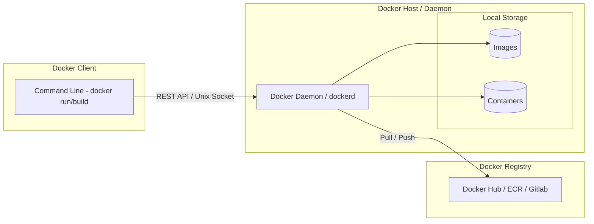
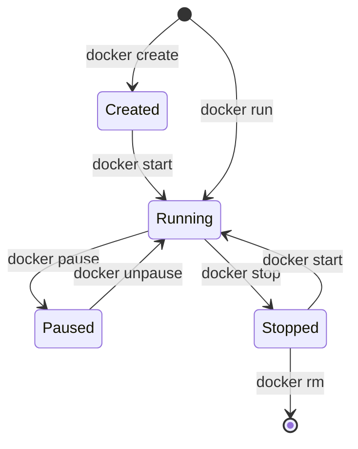
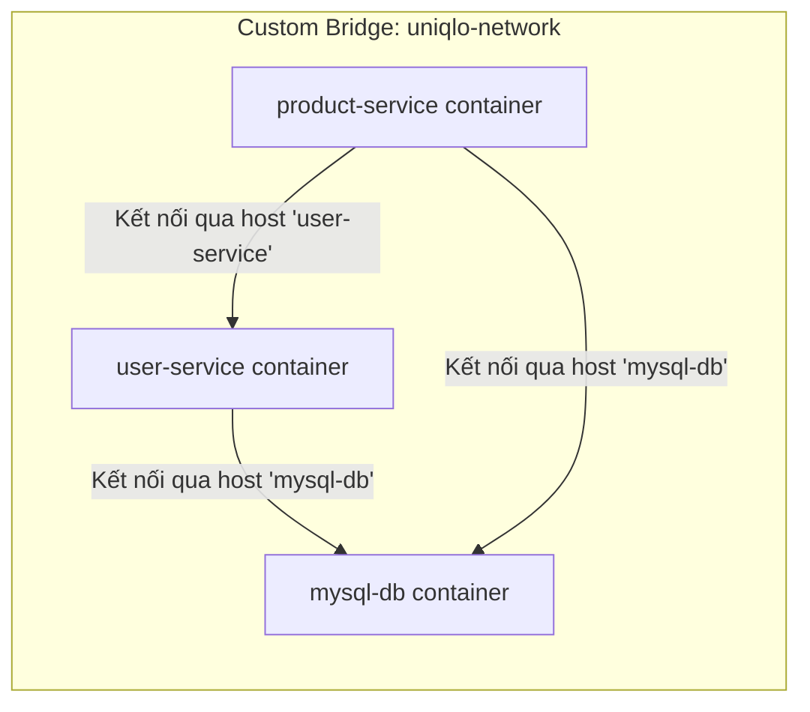
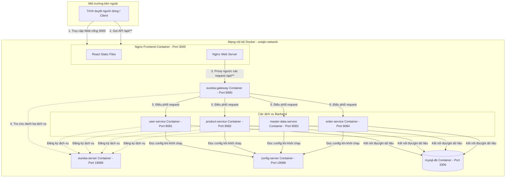

# GIÁO TRÌNH HỌC TẬP: DOCKER TỪ ZERO ĐẾN HERO
**Giảng viên**: Chuyên gia phát triển ứng dụng & Giảng viên lập trình
**Học phần**: Triển khai và Đóng gói Ứng dụng với Docker (Focus: Spring Boot & React)

---

## 🎯 MỤC TIÊU KHÓA HỌC
1. **Hiểu rõ bản chất**: Nắm vững cơ chế Containerization (Namespaces, Cgroups, UnionFS) so với ảo hóa truyền thống (Virtual Machine).
2. **Thành thạo Docker CLI**: Quản lý thuần thục Image, Container, Network, Volume qua các câu lệnh thực tế.
3. **Đóng gói ứng dụng tối ưu**: Tự viết Dockerfile chuẩn production sử dụng Multi-stage Build cho Java Spring Boot, ReactJS.
4. **Orchestration cơ bản**: Sử dụng Docker Compose để thiết lập hệ thống Multi-container phức tạp (Web + DB + Redis + Gateway).
5. **Kiến thức Cloud-Native**: Hiểu về CI/CD, Container Registry và nền tảng chuẩn bị cho Kubernetes (K8s).

---

## 🟢 MODULE 1: TỔNG QUAN VỀ DOCKER & CONTAINERIZATION

### 1.1 Vấn đề của việc triển khai phần mềm truyền thống
Trong phát triển và vận hành phần mềm truyền thống, các lập trình viên và quản trị hệ thống thường đối mặt với các vấn đề lớn:
*   **Hội chứng "It works on my machine!"**: Ứng dụng chạy hoàn hảo trên máy tính của lập trình viên (Developer) nhưng lại gặp lỗi nghiêm trọng khi triển khai trên máy chủ kiểm thử (Staging) hoặc sản xuất (Production). Nguyên nhân chủ yếu do sự sai khác về phiên bản hệ điều hành, thư viện dùng chung (DLL/SO), biến môi trường, hoặc các cấu hình hệ thống khác.
*   **Xung đột môi trường (Dependency Hell)**: Khi triển khai nhiều ứng dụng trên cùng một máy chủ vật lý hoặc máy ảo, các ứng dụng có thể yêu cầu các phiên bản khác nhau của cùng một thư viện (ví dụ: App A cần Java 8, App B cần Java 17; hoặc các phiên bản thư viện C/C++ xung đột nhau).
*   **Sự cồng kềnh của Virtual Machines (VM)**: Để giải quyết xung đột, giải pháp trước đây là dùng máy ảo (VMware, VirtualBox, Hyper-V). Tuy nhiên, mỗi VM đòi hỏi một hệ điều hành khách hoàn chỉnh (Guest OS) riêng biệt, tiêu tốn hàng GB RAM/Ổ cứng và mất từ vài chục giây đến vài phút để khởi động.

### 1.2 Containerization là gì?
**Containerization (Công nghệ Container hóa)** là phương pháp ảo hóa ở cấp độ hệ điều hành (OS-level virtualization), cho phép chạy nhiều môi trường ứng dụng cô lập trên cùng một nhân hệ điều hành (Host Kernel) mà không cần Guest OS.

#### Ảo hóa phần cứng (VM) vs Ảo hóa hệ điều hành (Container)

```mermaid
graph TD
    subgraph VM_Architecture [Kiến trúc Virtual Machine (VM)]
        VM_HW[Phần cứng vật lý - Infrastructure] --> VM_HostOS[Hệ điều hành Host OS]
        VM_HostOS --> Hypervisor[Hypervisor - ESXi, VirtualBox]
        
        Hypervisor --> VM1[VM 1]
        Hypervisor --> VM2[VM 2]
        
        subgraph VM1 [VM 1]
            GOS1[Guest OS] --> Libs1[Libraries/Bins]
            Libs1 --> App1[App A]
        end
        
        subgraph VM2 [VM 2]
            GOS2[Guest OS] --> Libs2[Libraries/Bins]
            Libs2 --> App2[App B]
        end
    end

    subgraph Container_Architecture [Kiến trúc Container (Docker)]
        C_HW[Phần cứng vật lý - Infrastructure] --> C_HostOS[Hệ điều hành Host OS]
        C_HostOS --> DockerEngine[Docker Engine / Container Runtime]
        
        DockerEngine --> Cont1[Container 1]
        DockerEngine --> Cont2[Container 2]
        
        subgraph Cont1 [Container 1]
            CLibs1[Shared Libraries/Bins] --> CApp1[App A]
        end
        
        subgraph Cont2 [Container 2]
            CLibs2[Shared Libraries/Bins] --> CApp2[App B]
        end
    end
```

| Tiêu chí | Máy ảo (Virtual Machine - VM) | Container (Docker) |
| :--- | :--- | :--- |
| **Hệ điều hành** | Mỗi VM có một Guest OS riêng biệt | Chia sẻ chung nhân (Kernel) của Host OS |
| **Dung lượng** | Rất nặng (từ vài GB đến hàng chục GB) | Rất nhẹ (chỉ từ vài MB đến vài trăm MB) |
| **Thời gian khởi động** | Chậm (tính bằng phút do phải boot Guest OS) | Cực nhanh (tính bằng mili-giây hoặc giây) |
| **Hiệu năng** | Bị hao hụt do qua lớp ảo hóa phần cứng | Gần như tương đương với ứng dụng chạy trực tiếp (Native) |
| **Độ cô lập** | Cô lập mức phần cứng (Rất an toàn) | Cô lập mức tiến trình (Yếu hơn VM một chút) |

#### Bản chất kỹ thuật dưới nhân Linux (Linux Kernel)
Docker đạt được sự cô lập này nhờ ba công nghệ cốt lõi của nhân Linux:
1.  **Namespaces (Không gian tên)**: Cô lập tài nguyên hệ thống cho tiến trình.
    *   *PID Namespace*: Cô lập danh sách tiến trình (tiến trình trong container không thấy tiến trình bên ngoài).
    *   *NET Namespace*: Cô lập card mạng, cổng (port), bảng định tuyến.
    *   *MNT Namespace*: Cô lập hệ thống file mount.
    *   *IPC Namespace*: Cô lập chia sẻ bộ nhớ giữa các tiến trình.
    *   *UTS Namespace*: Cô lập Hostname và Domain name.
    *   *USER Namespace*: Cô lập User và Group ID.
2.  **Control Groups (Cgroups)**: Giới hạn và giám sát tài nguyên phần cứng (CPU, RAM, băng thông mạng, I/O ổ cứng) mà một container được phép sử dụng.
3.  **Union File System (UnionFS)**: Hệ thống file phân lớp (Layered File System), cho phép kết hợp nhiều thư mục khác nhau thành một hệ thống file duy nhất. Giúp tiết kiệm ổ cứng nhờ cơ chế Copy-on-Write (CoW).

### 1.3 Kiến trúc Docker (Docker Architecture)
Mô hình Docker hoạt động theo kiến trúc Client-Server:



*   **Docker Daemon (dockerd)**: Tiến trình chạy ngầm trên máy chủ, tiếp nhận các yêu cầu từ Docker Client để quản lý và vận hành các đối tượng Docker (Images, Containers, Networks, Volumes).
*   **Docker Client (docker CLI)**: Giao diện dòng lệnh giúp người dùng tương tác với Docker Daemon. Khi gõ lệnh `docker run`, Client gửi API request tới Docker Daemon thông qua REST API hoặc Unix socket `/var/run/docker.sock`.
*   **Docker Image**: Bản thiết kế (template) chỉ đọc (Read-only), chứa mã nguồn, thư viện, biến môi trường và file cấu hình cần thiết để chạy ứng dụng. Image được tạo ra từ Dockerfile và gồm nhiều lớp (layers) xếp chồng lên nhau.
*   **Docker Container**: Một instance đang chạy của một Image. Bạn có thể tạo, chạy, dừng, di chuyển hoặc xóa một container. Container có thêm một lớp ghi được (Read-Write layer) nằm trên cùng của các lớp chỉ đọc của Image.
*   **Docker Registry**: Nơi lưu trữ và phân phối các Docker Images (ví dụ: Docker Hub, Amazon ECR, Google Container Registry - GCR).

---

## 🟢 MODULE 2: LÀM VIỆC VỚI IMAGES & CONTAINERS

### 2.1 Quản lý Images
Các câu lệnh tương tác trực tiếp với Image:
*   `docker pull <image_name>:<tag>`: Tải Image từ Registry về máy host. Nếu không chỉ định `<tag>`, mặc định sẽ lấy tag `latest`.
    *   *Ví dụ*: `docker pull mysql:8.0`
*   `docker images` hoặc `docker image ls`: Liệt kê tất cả các Images đang có trên máy host.
*   `docker rmi <image_id_or_name>`: Xóa một hoặc nhiều Images khỏi máy host.
*   `docker image prune`: Dọn dẹp các images "dangling" (những image không có tag và không được container nào sử dụng). Thêm flag `-a` để xóa tất cả các image không có container nào sử dụng.

### 2.2 Vòng đời Container (Container Lifecycle)
Một container trải qua các trạng thái: Created -> Running -> Paused -> Stopped -> Deleted.



#### Các câu lệnh điều khiển Container:
*   `docker run [options] <image> [command]`: Tạo mới và khởi chạy một container từ Image.
    *   *Các flag cực kỳ quan trọng*:
        *   `-d` (detach): Chạy container dưới nền (background), trả lại quyền điều khiển terminal cho host.
        *   `-p <host_port>:<container_port>` (port mapping): Ánh xạ cổng từ máy host vào cổng bên trong container.
        *   `--name <container_name>`: Đặt tên gợi nhớ cho container (nếu không có, Docker tự sinh tên ngẫu nhiên).
        *   `-e <KEY>=<VALUE>` (environment): Thiết lập biến môi trường bên trong container.
        *   `-v <host_path>:<container_path>` (volume): Gắn kết thư mục từ host vào container để lưu trữ dữ liệu.
        *   `--restart <policy>`: Chính sách tự động khởi động lại container (VD: `always`, `unless-stopped`).
*   `docker ps`: Liệt kê các container đang chạy.
    *   *Flag hữu dụng*: `docker ps -a` hiển thị tất cả các container kể cả đã dừng.
*   `docker stop <container_id_or_name>`: Dừng container đang chạy bằng cách gửi tín hiệu `SIGTERM`, sau một khoảng thời gian sẽ gửi `SIGKILL`.
*   `docker kill <container_id_or_name>`: Dừng container ngay lập tức bằng cách gửi tín hiệu `SIGKILL`.
*   `docker start <container_id_or_name>`: Khởi động lại một container đã bị dừng trước đó.
*   `docker rm <container_id_or_name>`: Xóa container đã dừng. Thêm flag `-f` để ép buộc xóa container đang chạy.
*   `docker logs <container_id_or_name>`: Xem log đầu ra (stdout/stderr) của ứng dụng bên trong container.
    *   *Flag hữu dụng*: `docker logs -f --tail 100 <name>` (theo dõi log thời gian thực).
*   `docker exec -it <container_id_or_name> <command>`: Thực thi một lệnh trực tiếp bên trong container đang chạy.
    *   *Flag hữu dụng*: `-it` (interactive + tty) kết hợp lệnh `/bin/sh` hoặc `/bin/bash` mở terminal tương tác bên trong container.
        *   *Ví dụ*: `docker exec -it my-mysql mysql -u root -p`

---

## 🟢 MODULE 3: DOCKERFILE - ĐÓNG GÓI ỨNG DỤNG

### 3.1 Dockerfile là gì?
**Dockerfile** là một file văn bản không có phần mở rộng, chứa một tập hợp các chỉ thị (instructions) có thứ tự để Docker Engine tự động xây dựng (build) nên một Docker Image.

### 3.2 Các Instruction cốt lõi
*   **FROM**: Định nghĩa Base Image (ảnh nền) để bắt đầu xây dựng (phải là lệnh đầu tiên). Khuyên dùng các bản rút gọn như `-alpine` hoặc `-slim` để giảm dung lượng image.
    *   *Ví dụ*: `FROM openjdk:17-jdk-alpine`
*   **WORKDIR**: Thiết lập thư mục làm việc mặc định cho tất cả các câu lệnh tiếp theo (`RUN`, `CMD`, `ENTRYPOINT`, `COPY`, `ADD`). Nếu thư mục chưa tồn tại, Docker sẽ tự tạo.
    *   *Ví dụ*: `WORKDIR /app`
*   **COPY**: Sao chép các file/thư mục từ máy host vào bên trong container.
    *   *Ví dụ*: `COPY pom.xml .`
*   **ADD**: Tương tự như COPY nhưng có thêm tính năng nâng cao: cho phép copy từ URL từ xa hoặc tự động giải nén các file nén (tar, zip) khi đưa vào container. (Khuyên dùng COPY để đảm bảo minh bạch).
*   **RUN**: Thực thi lệnh shell trong quá trình **build** image. Kết quả của lệnh được lưu thành một lớp (layer) mới trong image.
    *   *Ví dụ*: `RUN mvn clean package -DskipTests` hoặc `RUN apk add --no-cache curl`
*   **EXPOSE**: Khai báo cổng mà container sẽ lắng nghe khi chạy. Đây chỉ là thông tin mang tính chất tài liệu (documentation), không thực sự mở cổng hoặc map cổng ra ngoài máy host.
    *   *Ví dụ*: `EXPOSE 8080`
*   **ENV**: Thiết lập biến môi trường cố định trong suốt quá trình build và chạy container.
    *   *Ví dụ*: `ENV SPRING_PROFILES_ACTIVE=prod`
*   **CMD vs ENTRYPOINT**:
    *   **ENTRYPOINT**: Khai báo lệnh cố định luôn luôn chạy khi container khởi động.
    *   **CMD**: Định nghĩa các tham số mặc định cho ENTRYPOINT, hoặc là lệnh chạy mặc định nếu ENTRYPOINT không được định nghĩa. CMD có thể dễ dàng bị ghi đè khi ta truyền tham số từ dòng lệnh lúc chạy `docker run`.
    *   *Quy tắc kết hợp*:
        ```dockerfile
        ENTRYPOINT ["java", "-jar", "app.jar"]
        CMD ["--server.port=8080"]
        ```
        Nếu chạy `docker run my-app`, container chạy lệnh: `java -jar app.jar --server.port=8080`.
        Nếu chạy `docker run my-app --server.port=9090`, CMD bị ghi đè, container chạy: `java -jar app.jar --server.port=9090`.

### 3.3 Cơ chế Layer & Caching (Tối ưu hóa tốc độ build)
Mỗi chỉ thị trong Dockerfile (ngoại trừ các chỉ thị cấu hình như EXPOSE, ENV) tạo ra một lớp dữ liệu (Layer) mới trong Image.
Khi bạn build lại một Image, Docker sẽ kiểm tra xem các file nguồn và các lệnh trong Dockerfile có thay đổi hay không. Nếu không đổi, Docker sẽ tái sử dụng cache của layer cũ để tiết kiệm thời gian build.

#### Mẹo tối ưu hóa cache (Cache Layering)
Hãy viết Dockerfile theo thứ tự từ các chỉ thị ít thay đổi nhất đến các chỉ thị thường xuyên thay đổi nhất.

```dockerfile
# ❌ Cách viết TỒI (Không tận dụng được cache)
FROM maven:3.8.4-openjdk-17 AS build
WORKDIR /app
COPY . .
RUN mvn package  # Mỗi lần sửa 1 dòng code, Docker phải tải lại toàn bộ dependencies

#  Cách viết TỐT (Tận dụng cache dependency)
FROM maven:3.8.4-openjdk-17 AS build
WORKDIR /app
COPY pom.xml .
RUN mvn dependency:go-offline  # Tải trước dependencies và cache lại layer này
COPY src ./src
RUN mvn package -DskipTests    # Chỉ build code mới, cực kỳ nhanh
```

---

## 🟢 MODULE 4: LƯU TRỮ DỮ LIỆU (PERSISTENT STORAGE)

### 4.1 Tại sao cần Volume?
Mặc định, dữ liệu sinh ra trong container được ghi vào lớp lưu trữ ghi được (Writable Container Layer). Tuy nhiên, lớp này có các nhược điểm:
*   **Tính tạm thời (Ephemeral)**: Khi container bị xóa (`docker rm`), toàn bộ dữ liệu lưu trên lớp Writable Layer này sẽ bị mất sạch.
*   **Hiệu năng kém**: Việc ghi dữ liệu qua trình điều khiển lưu trữ (Storage Driver) của Docker làm giảm tốc độ I/O so với ghi trực tiếp vào hệ thống file của host.
*   **Khó chia sẻ**: Không thể chia sẻ dữ liệu dễ dàng giữa các container hoặc giữa host và container.

### 4.2 Các cơ chế lưu trữ

```mermaid
graph TD
    subgraph Host_OS [Host OS Storage]
        subgraph Docker_Area [/var/lib/docker/volumes/]
            VolData[Docker Managed Volume Data]
        end
        subgraph Normal_FS [Bất kỳ thư mục nào trên Host]
            HostDir[Host Folder /home/user/project]
        end
    end
    
    subgraph Container [Container Filesystem]
        CPath1[/var/lib/mysql]
        CPath2[/app/static]
    end
    
    VolData -->|Mounted to| CPath1
    HostDir -->|Mounted to| CPath2
```

1.  **Docker Volumes**:
    *   Được Docker quản lý hoàn toàn và lưu trữ trong thư mục riêng của Docker trên host (trên Linux mặc định là `/var/lib/docker/volumes/`).
    *   Được khuyên dùng cho các ứng dụng cơ sở dữ liệu (MySQL, PostgreSQL, MongoDB, Redis) vì tính an toàn, dễ backup và độc lập với cấu trúc thư mục của máy host.
    *   *Tạo volume*: `docker volume create db_data`
    *   *Gắn vào container*: `docker run -d -v db_data:/var/lib/mysql mysql:8`
2.  **Bind Mounts**:
    *   Ánh xạ trực tiếp một đường dẫn cụ thể trên máy host vào một đường dẫn bên trong container.
    *   Khuyên dùng trong quá trình phát triển (Development) để thực hiện Hot-reload code (sửa code ở máy host lập tức cập nhật vào container mà không cần build lại image).
    *   *Gắn vào container*: `docker run -d -v D:/my-project/html:/usr/share/nginx/html nginx`
3.  **tmpfs Mounts**:
    *   Lưu trữ dữ liệu tạm thời trong bộ nhớ RAM của máy host. Khi container dừng, dữ liệu sẽ mất hoàn toàn.
    *   Dùng cho các dữ liệu cần bảo mật cao (như lưu khóa token tạm thời) hoặc các dữ liệu ghi tạm tốc độ cực cao.

---

## 🟢 MODULE 5: DOCKER NETWORKING

### 5.1 Các Network Drivers mặc định
*   **Bridge (Mặc định)**: Tạo ra một dải mạng ảo nội bộ trên máy host. Các container kết nối vào dải mạng này nhận được một IP nội bộ. Chúng cô lập với bên ngoài nhưng có thể kết nối ra internet thông qua cơ chế NAT.
*   **Host**: Loại bỏ hoàn toàn sự cô lập mạng giữa container và máy host. Container dùng chung cổng và địa chỉ IP trực tiếp của máy host.
    *   *Ví dụ*: Chạy Nginx cổng 80 chế độ host thì cổng 80 của máy host sẽ bị chiếm dụng ngay lập tức mà không cần dùng flag `-p`.
*   **None**: Container hoàn toàn không có card mạng mạng ngoài loopback (`127.0.0.1`), không thể kết nối mạng.
*   **Overlay**: Kết nối các Docker Daemon trên các máy chủ vật lý khác nhau, phục vụ cho cụm điều phối Docker Swarm.

### 5.2 Custom Bridge Network & DNS Resolution
Khi sử dụng mạng mặc định (default bridge), các container chỉ có thể liên lạc với nhau thông qua địa chỉ IP nội bộ (IP này thay đổi mỗi lần container khởi động lại).
**Giải pháp**: Tạo ra một **Custom Bridge Network**.
*   *Tính năng quan trọng*: Tất cả các container kết nối vào cùng một Custom Bridge Network có thể tự động phân giải tên miền (DNS Resolution) lẫn nhau bằng **tên Container (Container Name)** thay vì IP.



*   *Lệnh thực hành*:
    ```bash
    # 1. Tạo mạng riêng
    docker network create uniqlo-net
    
    # 2. Chạy container Database và gắn vào mạng
    docker run -d --name mysql-db --network uniqlo-net -e MYSQL_ROOT_PASSWORD=root mysql:8
    
    # 3. Chạy container Java Service kết nối tới host 'mysql-db' thay vì 'localhost'
    docker run -d --name user-service --network uniqlo-net -p 8081:8081 -e SPRING_DATASOURCE_URL=jdbc:mysql://mysql-db:3306/uniqlo_education my-user-service:v1
    ```

---

## 🟢 MODULE 6: DOCKER COMPOSE (MULTI-CONTAINER ORCHESTRATION)

### 6.1 Giới thiệu Docker Compose
Trong một hệ thống Microservices, ta phải vận hành hàng chục container đồng thời. Việc gõ thủ công từng câu lệnh `docker run` kèm hàng tá cấu hình mạng, volume là bất khả thi.
**Docker Compose** là công cụ giúp định nghĩa và quản lý đa container bằng một file cấu hình duy nhất: `docker-compose.yml` (sử dụng định dạng YAML).

### 6.2 Cấu trúc file docker-compose.yml mẫu
```yaml
version: '3.8'

services:
  mysql-db:
    image: mysql:8.0
    container_name: mysql-db
    ports:
      - "3306:3306"
    environment:
      MYSQL_ROOT_PASSWORD: ${DB_PASSWORD}
      MYSQL_DATABASE: uniqlo_education
    volumes:
      - mysql_data:/var/lib/mysql
    networks:
      - uniqlo-network
    healthcheck:
      test: ["CMD", "mysqladmin", "ping", "-h", "localhost"]
      interval: 10s
      timeout: 5s
      retries: 5

  user-service:
    build:
      context: ./user-service
      dockerfile: Dockerfile
    container_name: user-service
    ports:
      - "8081:8081"
    environment:
      SPRING_DATASOURCE_URL: jdbc:mysql://mysql-db:3306/uniqlo_education?useUnicode=true&characterEncoding=UTF-8
      SPRING_DATASOURCE_USERNAME: root
      SPRING_DATASOURCE_PASSWORD: ${DB_PASSWORD}
      EUREKA_CLIENT_SERVICEURL_DEFAULTZONE: http://eureka-server:19089/eureka/
    depends_on:
      mysql-db:
        condition: service_healthy
    networks:
      - uniqlo-network

volumes:
  mysql_data:

networks:
  uniqlo-network:
    driver: bridge
```

### 6.3 Quản lý ứng dụng với Docker Compose
*   `docker-compose up -d`: Đọc file `docker-compose.yml`, tải các image thiếu, build các Dockerfile cục bộ, tạo mạng/volume và khởi chạy toàn bộ hệ thống dưới nền.
*   `docker-compose up -d --build`: Ép buộc build lại các Dockerfile nội bộ và chạy lại hệ thống (dùng khi bạn vừa sửa mã nguồn backend/frontend).
*   `docker-compose down`: Dừng và xóa toàn bộ container, mạng được tạo bởi file compose đó (giữ lại volumes trừ khi thêm flag `-v`).
*   `docker-compose logs -f`: Theo dõi log của tất cả các services đồng thời. Bạn cũng có thể chỉ định dịch vụ cụ thể: `docker-compose logs -f user-service`.
*   `docker-compose ps`: Xem danh sách các container thuộc quản lý của file compose.

### 6.4 Environment Variables & Bảo mật với `.env`
Tránh tuyệt đối việc hardcode thông tin nhạy cảm (mật khẩu database, khóa bí mật JWT) vào file `docker-compose.yml` để tránh rò rỉ mã nguồn trên GitHub.
Tạo file `.env` nằm cùng thư mục với `docker-compose.yml`:
```env
DB_PASSWORD=my_secure_root_password
JWT_SECRET_KEY=5367566B59703373367639792F423F4528482B4D6251655468576D5A71347437
```
Docker Compose sẽ tự động nạp các biến này và thay thế các placeholder dạng `${DB_PASSWORD}` trong file YAML.

---

## 🟢 MODULE 7: DOCKER NÂNG CAO & TỐI ƯU HÓA (ADVANCED)

### 7.1 Multi-stage Builds
Trong cách build truyền thống, Image thành phẩm chứa toàn bộ các công cụ biên dịch (JDK, Maven, Node.js, npm, compilers) vốn chỉ dùng trong khâu phát triển. Điều này khiến Image phình to hàng GB, tăng bề mặt tấn công bảo mật.
**Multi-stage Build** chia Dockerfile thành nhiều giai đoạn (stages) độc lập:
*   *Stage 1 (Build)*: Dùng Base Image đầy đủ công cụ để biên dịch source code sang file nhị phân (Jar, Build static files).
*   *Stage 2 (Run)*: Dùng Base Image siêu nhẹ (như alpine JRE, nginx-alpine) và chỉ sao chép kết quả đã biên dịch từ Stage 1 sang.

#### So sánh quy trình build đơn lớp vs Multi-stage

```mermaid
graph TD
    subgraph Single_Stage [Build Đơn Lớp - Image nặng 800MB]
        S_JDK[Base Image: JDK + Maven] --> S_Src[Copy Source Code]
        S_Src --> S_Build[Run maven install]
        S_Build --> S_Final[Image chứa cả JDK, Maven, Cache local repository và JAR]
    end

    subgraph Multi_Stage [Build Đa Lớp - Image nặng 100MB]
        subgraph Stage1 [Giai đoạn 1: Build]
            M_JDK[Base Image: JDK + Maven] --> M_Src[Copy Source Code]
            M_Src --> M_Build[Run package -> app.jar]
        end
        
        subgraph Stage2 [Giai đoạn 2: Run]
            M_JRE[Base Image: Alpine JRE - siêu nhỏ]
            M_Build -->|Chỉ Copy file 'app.jar' sang| M_JRE
            M_JRE --> M_Final[Image thành phẩm cực kỳ nhẹ]
        end
    end
```



#### Dockerfile Multi-stage mẫu cho Spring Boot (Java 17):
```dockerfile
# Stage 1: Build application
FROM maven:3.8.4-openjdk-17-slim AS builder
WORKDIR /app
COPY pom.xml .
RUN mvn dependency:go-offline
COPY src ./src
RUN mvn package -DskipTests

# Stage 2: Minimal runtime image
FROM openjdk:17-jdk-slim
WORKDIR /app
COPY --from=builder /app/target/*.jar app.jar
EXPOSE 8080
ENTRYPOINT ["java", "-jar", "app.jar"]
```

### 7.2 Bảo mật Container (Security Best Practices)
1.  **Không chạy dưới quyền root**: Mặc định Docker chạy container dưới quyền root. Nếu tin tặc xâm nhập được vào container, họ có thể khai thác lỗ hổng thoát container để chiếm quyền root máy host.
    ```dockerfile
    RUN addgroup -S appgroup && adduser -S appuser -G appgroup
    USER appuser
    ```
2.  **Hệ thống file Read-only**: Đảm bảo hacker không thể tải mã độc về ghi vào file hệ thống bằng cách chạy container ở chế độ chỉ đọc:
    *   Chạy lệnh: `docker run --read-only my-app`
3.  **Giới hạn tài nguyên phần cứng**: Ngăn chặn lỗi rò rỉ bộ nhớ (memory leak) ở một container làm sập toàn bộ máy chủ (Out of Memory):
    *   `docker run -m 512m --cpus="1.5" my-app`
4.  **Scan bảo mật**: Tích hợp quét lỗ hổng thư viện trong image:
    *   `docker scout quickview <image>` hoặc dùng công cụ Trivy.

### 7.3 Healthcheck
Sử dụng chỉ thị `HEALTHCHECK` giúp Docker Engine chủ động kiểm tra trạng thái hoạt động thực sự của ứng dụng bên trong container chứ không chỉ kiểm tra tiến trình có sống hay không.
```dockerfile
HEALTHCHECK --interval=30s --timeout=3s --retries=3 \
  CMD curl -f http://localhost:8080/actuator/health || exit 1
```

---

## 🟢 MODULE 8: CI/CD VỚI DOCKER & REGISTRY

### 8.1 Quy trình phát hành Image lên Container Registry
Để chia sẻ Image giữa các thành viên hoặc đưa lên máy chủ cloud, ta sử dụng Container Registry (Docker Hub là mặc định).
Các bước thực hiện:
```bash
# 1. Đăng nhập Docker Registry từ dòng lệnh
docker login

# 2. Đặt tag cho Image theo đúng định dạng tài khoản
# Cú pháp: docker tag <local_image> <registry_username>/<repo_name>:<tag>
docker tag uniqlo-user-service:latest ndkien98/uniqlo-user-service:v1.0

# 3. Đẩy Image lên registry
docker push ndkien98/uniqlo-user-service:v1.0
```

### 8.2 Tự động hóa CI/CD với GitHub Actions
Sử dụng GitHub Actions để tự động hóa: mỗi khi lập trình viên đẩy mã nguồn mới lên nhánh `main`, hệ thống tự động build Docker Image, quét lỗi, và đẩy lên Docker Hub.

**File cấu hình mẫu: `.github/workflows/docker.yml`**
```yaml
name: Docker Image Build & Push CI

on:
  push:
    branches: [ "main" ]

jobs:
  build-and-push:
    runs-on: ubuntu-latest
    steps:
    - name: Checkout code
      uses: actions/checkout@v3

    - name: Set up JDK 17
      uses: actions/setup-java@v3
      with:
        java-version: '17'
        distribution: 'temurin'

    - name: Login to Docker Hub
      uses: docker/login-action@v2
      with:
        username: ${{ secrets.DOCKERHUB_USERNAME }}
        password: ${{ secrets.DOCKERHUB_TOKEN }}

    - name: Build and Push User Service
      uses: docker/build-push-action@v4
      with:
        context: ./8. microservice/source_microservice/user-service
        push: true
        tags: ${{ secrets.DOCKERHUB_USERNAME }}/uniqlo-user-service:latest
```

---

## 🟢 MODULE 9: HỆ SINH THÁI DOCKER & BƯỚC TIẾP THEO

### 9.1 Các công cụ quản trị trực quan
*   **Portainer**: Giao diện quản trị Web UI trực quan cho Docker. Giúp xem thông số CPU/RAM, đọc log, khởi động, dừng, xóa container mà không cần dùng CLI.
    *   *Chạy Portainer nhanh*:
        ```bash
        docker run -d -p 9000:9000 --name portainer --restart=always -v /var/run/docker.sock:/var/run/docker.sock -v portainer_data:/data portainer/portainer-ce
        ```
*   **Lazydocker**: Terminal UI (giao diện đồ họa trong terminal) cực nhanh, giúp quản trị Docker trực tiếp trên CLI mà không cần gõ lệnh.

### 9.2 Container Orchestration (Điều phối Container ở quy mô lớn)
Khi hệ thống mở rộng từ vài container lên hàng trăm, hàng ngàn container chạy trên nhiều máy chủ vật lý khác nhau, Docker Compose không còn đáp ứng được (do chỉ chạy được trên 1 máy host duy nhất). Lúc này ta cần các hệ thống điều phối cụm (Orchestrators):
*   **Docker Swarm**: Giải pháp tích hợp sẵn của Docker. Rất dễ sử dụng, cấu hình qua file yml tương tự compose, nhưng ít tính năng nâng cao.
*   **Kubernetes (K8s)**: Tiêu chuẩn công nghiệp của thế giới Cloud-Native. K8s quản lý tự động việc mở rộng tải (Autoscaling), tự sửa chữa lỗi (Self-healing - tự khởi động lại container bị sập, thay thế node lỗi), nâng cấp không gián đoạn (Rolling updates), cân bằng tải tự động.

---

## 🏆 MODULE 10: DỰ ÁN TỔNG HỢP (CAPSTONE PROJECT)
### TRIỂN KHAI HỆ THỐNG MICROSERVICES UNIQLO LÊN DOCKER

Hệ thống E-commerce Uniqlo bao gồm các cấu phần hạ tầng:
1.  **Database**: MySQL 8 lưu trữ toàn bộ dữ liệu.
2.  **Config Server (Port 19088)**: Quản lý cấu hình tập trung.
3.  **Eureka Discovery Server (Port 19089)**: Quản lý định danh dịch vụ.
4.  **API Gateway (Port 8080)**: Cổng giao tiếp, điều hướng API duy nhất cho Frontend.
5.  **User Service (Port 8081)**: Quản lý đăng ký, đăng nhập, phân quyền, JWT.
6.  **Product Service (Port 8082)**: Quản lý sản phẩm, thông tin chi tiết.
7.  **Master Data Service (Port 8083)**: Danh mục sản phẩm, màu sắc, kích cỡ.
8.  **Order Service (Port 8084)**: Quản lý giỏ hàng, đơn hàng, thanh toán.
9.  **React Frontend (Port 3000)**: Giao diện người dùng web chạy Nginx proxy API.

#### Sơ đồ kết nối hệ thống trong mạng Docker



#### Quy tắc cấu hình Container hóa hệ thống Uniqlo Microservice
Để chạy được dự án này một cách tự động, chúng ta thực hiện 3 cải tiến quan trọng:
1.  **Cấu hình DNS Service Discovery thông qua Docker Network**: Eureka URL sẽ là `http://eureka-server:19089/eureka/` thay vì `localhost`.
2.  **Nạp cấu hình động bằng Biến môi trường**: Override `spring.datasource.url` thành `jdbc:mysql://mysql-db:3306/uniqlo_education` qua biến môi trường của container.
3.  **Tận dụng Multi-stage Build cho Nginx & React**: Frontend React được build sang code static và host bằng Nginx. Tất cả request `/api/*` được Nginx chuyển tiếp (proxy_pass) đến `http://eureka-gateway:8080`.

*(Chi tiết mã nguồn Dockerfile và file docker-compose.yml được trình bày cụ thể trong phần thực hành Capstone Project).*
